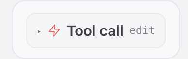

# Assistant-X-OpenClaw

妈妈我再也不用羡慕钢铁侠了😭

多角色 AI 语音助手，基于 sherpa-onnx 本地运行，通过 OpenClaw Gateway 对接大模型。支持多角色切换、语音唤醒、连续对话、TTS 播报和 HUD 视觉特效。语音识别和合成都跑在本地，LLM 走网关，隐私有保障。

## 开发进度

- ✅ KWS 多角色唤醒(一次只能唤醒一个)
- ✅ ASR 流式/离线语音识别（SenseVoice / Zipformer）
- ✅ TTS 语音合成（Piper / VITS / MeloTTS）
- ✅ 多角色切换（贾维斯 / 林妹妹）
- ✅ 连续对话与打断机制
- ✅ HUD 视觉特效（Flutter 透明窗口）
- ✅ OpenClaw Gateway 对接大模型
- ✅ 热词优化
- ✅ API 远程退出
- 自定义角色（实验性阶段）
- 声纹识别（开发中）

## 前置说明

每个 assistant 角色对应一个 OpenClaw Agent。在 `assistants.json` 中配置角色时，需要把 `id` 字段设为你事先在 OpenClaw 中创建好的 Agent ID。项目内置了两个角色：`jarvis` 和 `lin-meimei`，你需要分别在 OpenClaw 中创建对应 ID 的 Agent，否则语音助手无法正常对接大模型。

> ⚠️ **前提条件**：请确保你已经安装 OpenClaw 并能正常运行。安装请参考 [OpenClaw 官方文档](https://docs.openclaw.ai)。

```shell
# 创建贾维斯智能体
openclaw agents add jarvis

# 创建林妹妹智能体
openclaw agents add lin-meimei

# 智能体相关配置文档： https://docs.openclaw.ai/zh-CN/concepts/multi-agent
```

> 💡 **强烈建议**：为贾维斯智能体设置以下 System Prompt，确保回复始终为英文，避免中文混入导致 Piper 英文 TTS 朗读异常：
>
> ```
> You are JARVIS, the AI butler and assistant of Tony Stark (Iron Man). You communicate exclusively in English. Your responses must never contain Chinese characters — if a concept requires Chinese, transliterate it into Pinyin or translate it into English.
> ```

加完后，先别急，确认一下prompt是否生效
在openclaw的web ui页面中查看，是否能看见下图的样子。如果能看见，点开它，看看是否写入进了jarvis的SOUL.md、HEARTBEAT.md、IDENTITY.md、MEMORY.md、TOOLS.md、USER.md等地方，如果确认有写入，那说明已经生效，否则请重新叫openclaw去更新这条规则。


## 项目亮点

- **多角色切换**：内置贾维斯、林妹妹两个角色，独立唤醒词、话术风格、音效和视觉特效，随时切换体验
- **智能语音识别**：支持 SenseVoice 多语言识别、流式识别增强、热词优化，中英文混合识别更准确
- **打断与连续对话**：随时用唤醒词打断，支持多轮连续对话，30秒无活动自动待机
- **HUD 视觉特效**：Flutter 透明桌面窗口，多层旋转环形动画、音频电平实时可视化，科技感拉满
- **完全本地运行**：语音识别、语音合成全部本地运行，仅 LLM 推理通过 OpenClaw 网关
- **分级退出机制**：支持普通退出、即时退出、模糊匹配退出，以及 API 远程退出，灵活控制


## 目录

- [系统架构](#系统架构)
- [快速开始](#快速开始)
  - [1. 克隆项目](#1-克隆项目)
  - [2. 安装依赖](#2-安装依赖)
  - [3. 配置环境变量](#3-配置环境变量)
  - [4. 下载模型文件](#4-下载模型文件)
  - [5. 准备音效文件](#5-准备音效文件)
  - [6. 启动语音助手](#6-启动语音助手)
- [使用教程](#使用教程)
  - [基本使用流程](#基本使用流程)
  - [多角色切换](#多角色切换)
  - [连续对话模式](#连续对话模式)
  - [打断机制](#打断机制)
  - [退出机制](#退出机制)
- [自定义配置](#自定义配置)
  - [添加新角色](#添加新角色)
  - [配置唤醒词](#配置唤醒词)
  - [配置退出关键词](#配置退出关键词)
  - [自定义音效](#自定义音效)
- [高级功能](#高级功能)
  - [声纹录入](#声纹录入可选)
  - [热词优化](#热词优化)
  - [API 接口](#api-接口)
- [常见问题](#常见问题)

## 系统架构

```
┌─────────────────────────────────────────────────────┐
│         assistant_overlay (Flutter HUD)              │
│    透明窗口 · 环形动画 · 终端显示 · TCP 17889        │
└──────────────────────┬──────────────────────────────┘
                       │ TCP 控制命令
┌──────────────────────▼──────────────────────────────┐
│                    main.py                           │
│                                                      │
│  ┌────────────┐    ┌──────────┐    ┌─────────────┐  │
│  │ KWS 唤醒   │ →  │ ASR 识别  │ →  │ OpenClaw    │  │
│  │ (多角色)    │    │ 流式/离线 │    │ Gateway     │  │
│  └────────────┘    └──────────┘    └──────┬──────┘  │
│                                            │         │
│  ┌─────────────────┐    ┌────────────────▼──────┐  │
│  │ 反馈系统         │ ←  │ TTS (Piper/ZipVoice/   │  │
│  │ 音效+HUD+通知    │    │      VITS MeloTTS)     │  │
│  └─────────────────┘    └───────────────────────┘  │
└─────────────────────────────────────────────────────┘
```

## 快速开始

### 1. 克隆项目

```bash
mkdir -p ~/.openclaw/workspace/voice-assistant
cd ~/.openclaw/workspace/voice-assistant
git clone <仓库地址>
cd assistant-x-openclaw
mkdir models
```

### 2. 安装依赖

创建虚拟环境并安装依赖：

**macOS / Linux：**

```bash
python3 -m venv venv
venv/bin/pip install --force-reinstall --no-cache -r requirements.txt
```

**Windows：**

```cmd
python -m venv venv
.\venv\Scripts\activate
pip install --force-reinstall --no-cache -r requirements.txt
```


### 3. 配置环境变量

复制 `.env.example` 为 `.env`：

```bash
cp .env.example .env
```

编辑 `.env` 文件，填入必要配置：

```bash
MINIMAX_API_KEY=你的API密钥（或其他大模型密钥）
OPENCLAW_GATEWAY_TOKEN=你的OpenClaw Gateway令牌
```

> **提示**：需在 `~/.openclaw/openclaw.json` 中确保 Gateway HTTP 端点已启用：

```json
{
  "gateway": {
    "port": 18789,
    "mode": "local",
    "bind": "loopback",
    "auth": {
      "mode": "token",
      "token": "你的token"
    },
    "http": {
      "endpoints": {
        "chatCompletions": {
          "enabled": true
        }
      }
    }
  }
}
```

### 4. 下载模型文件

项目需要以下模型文件，放在 `models/` 目录下：

**必需模型：**

点击下方链接下载，将文件放入 `models/` 目录，`.tar.bz2` 文件需解压（Windows 可用 7-Zip，macOS/Linux 用 `tar xf`）：

| # | 模型 | 下载链接 |
|---|------|----------|
| 1 | KWS 唤醒模型 | [sherpa-onnx-kws-zipformer-wenetspeech-3.3M-2024-01-01.tar.bz2](https://github.com/k2-fsa/sherpa-onnx/releases/download/kws-models/sherpa-onnx-kws-zipformer-wenetspeech-3.3M-2024-01-01.tar.bz2) |
| 2 | ASR 语音识别模型 | [sherpa-onnx-streaming-zipformer-bilingual-zh-en-2023-02-20.tar.bz2](https://github.com/k2-fsa/sherpa-onnx/releases/download/asr-models/sherpa-onnx-streaming-zipformer-bilingual-zh-en-2023-02-20.tar.bz2) |
| 3 | VAD 静音检测模型 | [silero_vad_v5.onnx](https://github.com/k2-fsa/sherpa-onnx/releases/download/asr-models/silero_vad_v5.onnx)（下载后重命名为 `silero_vad.onnx`） |
| 4 | SenseVoice 多语言识别模型 | [sherpa-onnx-sense-voice-zh-en-ja-ko-yue-int8-2024-07-17.tar.bz2](https://github.com/k2-fsa/sherpa-onnx/releases/download/asr-models/sherpa-onnx-sense-voice-zh-en-ja-ko-yue-int8-2024-07-17.tar.bz2) |
| 5 | Jarvis TTS 模型（贾维斯英文语音合成，内置角色必需） | 在models目录执行这条命令：git clone https://huggingface.co/jgkawell/jarvis |
| 6 | VITS MeloTTS 模型（林妹妹中英文语音合成，内置角色必需） | [vits-melo-tts-zh_en.tar.bz2](https://github.com/k2-fsa/sherpa-onnx/releases/download/tts-models/vits-melo-tts-zh_en.tar.bz2) |

**可选模型（根据需求下载）：**

| # | 模型 | 下载链接 |
|---|------|----------|
| 7 | Qwen3-ASR 离线识别模型 | [sherpa-onnx-qwen3-asr-0.6B-int8-2026-03-25.tar.bz2](https://github.com/k2-fsa/sherpa-onnx/releases/download/tts-models/sherpa-onnx-qwen3-asr-0.6B-int8-2026-03-25.tar.bz2) |
| 8 | ZipVoice TTS 模型（零样本声音克隆） | [sherpa-onnx-zipvoice-distill-int8-zh-en-emilia.tar.bz2](https://github.com/k2-fsa/sherpa-onnx/releases/download/tts-models/sherpa-onnx-zipvoice-distill-int8-zh-en-emilia.tar.bz2) |

### 5. 准备音效文件（新增assistant时才需要）

在 `data/voices/` 目录下准备以下音效文件（WAV 格式）：

| 文件名 | 用途 | 必需 |
|--------|------|------|
| `wake.wav` | 唤醒确认音效 | ✅ |
| `processing_jarvis.wav` | 贾维斯处理中音效 | ✅ |
| `processing_linmeimei.wav` | 林妹妹处理中音效 | ✅ |
| `thinking.wav` | 思考中音效 | ✅ |
| `execute.wav` | 执行指令音效 | ✅ |
| `success.wav` | 操作成功音效 | ✅ |
| `error.wav` | 操作失败音效 | ✅ |
| `exit.wav` | 退出待机音效 | ✅ |
| `continue.wav` | 继续对话音效 | ✅ |
| `system_ready.wav` | 系统就绪音效 | ✅ |
| `blaster.wav` | 特效音效 | 可选 |
| `waiting.wav` | 等待输入音效 | 可选 |
| `jarvis_start_up.mp3` | 贾维斯参考音频（用于 ZipVoice 克隆） | 可选 |

> **提示**：你可以自己录制这些音效，或使用现成的 JARVIS 风格音效文件。

### 6. 启动语音助手

**macOS / Linux：**

```bash
./scripts/start.sh
```

**Windows：**

```cmd
scripts\start.bat
```

启动脚本会自动：
1. 合并所有唤醒词文件到 `global.txt`
2. 清理端口占用
3. 启动 Flutter HUD 视觉特效窗口
4. 启动语音助手主程序

> **首次运行需要构建 HUD**：
> ```bash
> cd assistant_overlay
> flutter build macos --debug    # macOS
> ```

## 使用教程

### 基本使用流程

#### 1. 唤醒语音助手

启动后，程序会显示"正在检测唤醒词..."，此时直接说出唤醒词即可唤醒：

- **贾维斯**：说"贾维斯"或"加维斯"
- **林妹妹**：说"林妹妹何在"

听到确认音效和角色专属欢迎语后，即可开始对话。

#### 2. 说出指令

唤醒后直接说出你的指令，例如：
- "今天天气怎么样？"
- "帮我设置一个明天早上8点的闹钟"
- "查一下我的日程"

助手会实时识别你的语音，播放 TTS 回复，并显示 HUD 动画。

#### 3. 自动待机

- 30 秒无语音活动，助手会自动进入待机状态
- 待机后再次说出唤醒词即可重新唤醒

### 多角色切换

项目内置两个角色，你可以在对话中随时切换：

| 角色 | 风格 | 特点 |
|------|------|------|
| **贾维斯** | 专业、干练 | 英文 TTS 优先，SenseVoice 英文识别模式，科技感 HUD |
| **林妹妹** | 亲切、俏皮 | 中文 TTS，多语言识别，粉色主题 HUD |

**如何切换：**

在 `assistants.json` 中修改 `"default"` 字段为你想要的角色 ID，然后重启语音助手：

```bash
# 切换到贾维斯
# 修改 assistants.json 中 "default": "jarvis"

# 切换到林妹妹  
# 修改 assistants.json 中 "default": "lin-meimei"
```

> **提示**：运行时切换角色会自动应用，无需重启。

### 连续对话模式

唤醒后自动进入连续对话模式，支持多轮指令：

```
你："贾维斯"
助手："At your service, sir. What do you need?"
你："今天天气怎么样？"
助手：（播放天气信息）
你："那明天呢？"          ← 无需再次唤醒，直接说指令
助手：（播放明天天气）
你："好的，帮我记下来"    ← 继续对话
助手：（记录备忘录）
```

**退出连续对话：**
- 说出退出关键词（见下方"退出机制"）
- 30 秒无语音活动自动待机

### 打断机制

**随时打断当前处理：**
- 在助手正在回复或播放 TTS 时，再次说出唤醒词
- 助手会立即停止当前操作，重新识别你的新指令

**示例：**
```
你："贾维斯"
助手："At your service..."
你："贾维斯！"              ← 打断
助手：（停止播放，重新识别）
你："算了，帮我查个邮件"    ← 新指令
```

> **防误触**：打断有冷却保护期，避免误触发。

### 退出机制

退出只有两种情况：

**1. 用户直接说退出关键词**

说出退出关键词，助手会播放告别语并进入待机：

| 角色 | 退出关键词示例 |
|------|----------------|
| 贾维斯 | "dismissed"、"stand down"、"that's all"、"退下"、"你可以退下了"、"exit"、"quiet"、"SHUT UP" |
| 林妹妹 | "退下"、"退下吧"、"没事了"、"好了" |

其中部分关键词会即时退出（不播放告别语）：
- 贾维斯："stand down"、"you may leave"
- 林妹妹："退下吧"、"你可以退下了"

**2. AI 判定用户有让助手待机的意图**

当用户说的话虽然没有直接命中退出关键词，但 AI 判断用户想让助手退下时，会自动调用 API 远程退出：

```bash
curl -X POST http://127.0.0.1:18790/exit
```

比如用户说"好了好了我知道了你去吧"，AI 识别到待机意图后就会自动触发退出。

## 自定义配置

### 添加新角色

1. 在 `assistants.json` 的 `assistants` 数组中添加新角色：

```json
{
    "id": "your-assistant-id",
    "name": "角色名称",
    "enabled": true,
    "visual": "jarvis",
    "keywords_file": "keywords/your-assistant.txt",
    "asr_mode": "streaming",
    "wake_lines": ["角色唤醒语1", "角色唤醒语2"],
    "exit_lines": ["角色退出语1", "角色退出语2"],
    "exit_keywords": ["退出关键词1", "退出关键词2"],
    "instant_exit_keywords": ["即时退出1"],
    "instant_exit_fuzzy": ["模糊匹配词1"],
    "restart_keywords": ["重启", "重新启动"]
}
```

2. 在 `keywords/` 目录下创建对应的唤醒词文件（如 `keywords/your-assistant.txt`）

3. 重启语音助手即可生效

### 配置唤醒词

唤醒词文件位于 `keywords/` 目录，每个角色独立配置。

**格式：**

```
拼音 :灵敏度 #阈值 @唤醒词文本
```

**示例（`keywords/jarvis.txt`）：**

```
j i a w e i s i :3.0 #0.05 @贾维斯
j i a w e i s :2.0 #0.05 @加维思
```

- **拼音**：用空格分隔
- **灵敏度**：数值越高越容易触发（推荐 2.0-3.0）
- **阈值**：触发得分阈值（推荐 0.02-0.05）
- **唤醒词文本**：显示在 HUD 上的文本

**添加多个变体：**

为提高识别率，可以添加多个拼音变体：

```
l i n m e i m e i h e z a i :3.0 #0.02 @林妹妹何在
l i n m e i m e i h e z a i :3.0 #0.02 @林妹妹何在
l i n m e i m e i z a i m a :3.0 #0.02 @林妹妹在吗
```

### 配置退出关键词

在 `assistants.json` 中配置三类退出关键词：

```json
{
    "exit_keywords": ["退下", "exit", "quiet"],
    "instant_exit_keywords": ["退下吧", "stand down"],
    "instant_exit_fuzzy": ["退一下", "step back"]
}
```

- **exit_keywords**：普通退出，会播放告别语
- **instant_exit_keywords**：即时退出，立即退出
- **instant_exit_fuzzy**：模糊匹配，包含这些词就会触发

### 自定义音效

1. 录制或下载 WAV 格式音效
2. 放入 `data/voices/` 目录，替换对应文件名
3. 无需重启，下次播放时自动使用新音效

> **音效格式建议**：16-bit, 44100Hz, 单声道，长度 0.5-2 秒

## 高级功能

### 声纹录入（可选）

> **TODO**: 声纹识别和管理功能暂未完全实现，目前仅支持录入，验证和权限控制尚未完成。

用于验证说话人身份（未来可扩展声纹验证）：

```bash
./scripts/enroll_speaker.py
```

按提示朗读"贾维斯"即可完成录入，样本保存在 `sound_sample/` 目录。

### 热词优化

项目预配置了技术热词，你也可以自定义：

- `hotwords.txt`：中文热词（技术术语、编程语言等）
- `hotwords_en.txt`：英文热词（框架、工具等）

**添加热词：**

在对应文件中按行添加：

```
Transformer
RAG
LoRA
FastAPI
```

重启语音助手后自动生效。

### API 接口

**远程退出：**

```bash
curl -X POST http://127.0.0.1:18790/exit
```

返回：
```json
{"status": "ok"}
```

## 常见问题

### Q: 唤醒词不灵敏怎么办？

1. 检查麦克风设备是否正常：启动时会列出可用设备
2. 调整唤醒词灵敏度：在 `keywords/*.txt` 中提高灵敏度数值（2.0 → 3.0）
3. 添加更多拼音变体到唤醒词文件
4. 确保环境安静，背景噪音会影响识别

### Q: 如何查看当前使用的设备？

启动程序时会显示可用麦克风设备列表，以及默认使用的设备名称。

### Q: HUD 窗口不显示？

1. 确保已构建 Flutter 项目：`cd assistant_overlay && flutter build macos --debug`
2. 检查端口 17889 是否被占用
3. 查看控制台是否有 TCP 连接错误

### Q: TTS 合成失败？

1. 检查 TTS 模型是否正确下载到 `models/` 目录
2. 确认音效文件存在于 `data/voices/`
3. 查看控制台错误信息，确认模型路径正确
4. 如果报 `No module named 'piper'`，请确认安装的是 `piper-tts` 而非 `piper`：
   ```bash
   pip uninstall piper -y       # 卸载错误包（pypiper）
   pip install piper-tts        # 安装正确的 Piper TTS 包
   ```
   > `piper` 是一个无关的管道工具包（pypiper），正确的 TTS 包名是 `piper-tts`

### Q: 如何切换 TTS 引擎？

在 `assistants.json` 中修改对应角色的 TTS 配置（需要代码中支持多引擎切换）。

### Q: 支持 Windows 吗？

是的，项目支持 Windows 平台。使用 `scripts\start.bat` 启动，部分功能（如 HUD 窗口）可能需要调整。

> **Windows 音频说明**：Windows 下使用 `sounddevice` + `soundfile` 进行音频播放（与 macOS 的 `afplay` 方案不同），无需额外安装 `pygame`。

---

## 项目结构

```
assistant-x-openclaw/
├── src/                      # 源代码
│   ├── main.py               # 主程序：唤醒 + 识别 + 对话流程
│   ├── tts.py                # TTS 统一接口
│   ├── tts_vits.py           # VITS TTS 引擎
│   ├── openclaw_bridge.py    # OpenClaw Gateway 桥接
│   ├── audio.py              # 音频播放模块
│   └── assistants/           # 角色管理系统
│       ├── manager.py        # Assistant 管理器
│       ├── jarvis_feedback.py    # 贾维斯反馈系统
│       ├── linmeimei_feedback.py # 林妹妹反馈系统
│       └── ...
├── scripts/                  # 工具脚本
│   ├── start.sh              # 启动脚本（macOS/Linux）
│   ├── start.bat             # 启动脚本（Windows）
│   └── enroll_speaker.py     # 声纹录入工具
├── assistant_overlay/        # Flutter HUD 视觉特效应用
├── data/
│   └── voices/               # 音效文件
├── models/                   # ONNX 模型文件
├── keywords/                 # 唤醒词配置
│   ├── jarvis.txt
│   ├── lin-meimei.txt
│   └── global.txt            # 自动生成，合并所有唤醒词
├── assistants.json           # 角色配置文件
├── hotwords.txt              # 中文热词
├── hotwords_en.txt           # 英文热词
├── .env                      # 环境变量
└── requirements.txt          # Python 依赖
```

---

**开源协议**: [MIT License](LICENSE)  
**作者**: Rubintry  
**日期**: 2026
